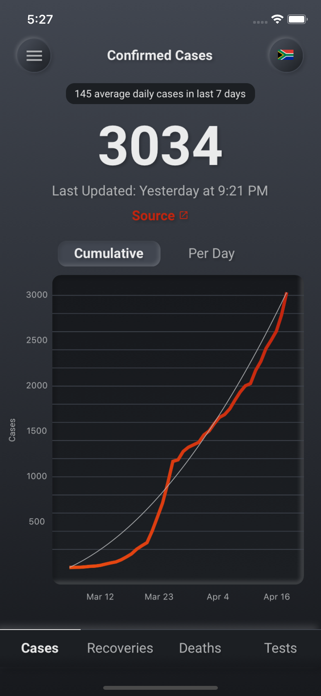

# covid-19-south-africa-app

<div>



</div>

## Development

1. Clone the project:

```
git clone https://github.com/shaunsaker/covid-19-south-africa-app.git
```

2. Install npm dependencies:

```
yarn
```

3. Install pods:

```
cd ios
pod install
```

4. Add your Firebase\* config files to `./ios/GoogleService-Info.plist` and `./android/app/google-services.json`.

5. Run the app:

```
yarn ios
yarn android
```

## \*Firebase

The project uses Firebase for it's backend. To get the app running locally you will need to:

1. Create a project in Firebase.

2. Enable the Cloud Firestore.

3. Add data to the Cloud Firestore with the following schema:

```typescript
type DateField = string; // e.g. 2020-04-01T17:20:27.038Z
type DocumentId = string; // e.g. 02-04-2020

interface DocumentBase {
  dateAdded: DateField;
  dateCreated: DateField;
  href: string;
}

interface ConfirmedCaseDocument extends DocumentBase {
  confirmedCases: number;
}

interface DeathCaseDocument extends DocumentBase {
  deaths: number;
}

interface RecoveryCaseDocument extends DocumentBase {
  recovered: number;
}

interface TestCaseDocument extends DocumentBase {
  tests: number;
}

interface Collections {
  confirmedCases: {
    [key: DocumentId]: ConfirmedCaseDocument;
  };
  deathCases: {
    [key: DocumentId]: DeathCasesDocument;
  };
  recoveries: {
    [key: DocumentId]: RecoveryCaseDocument;
  };
  tests: {
    [key: DocumentId]: TestCaseDocument;
  };
}
```
